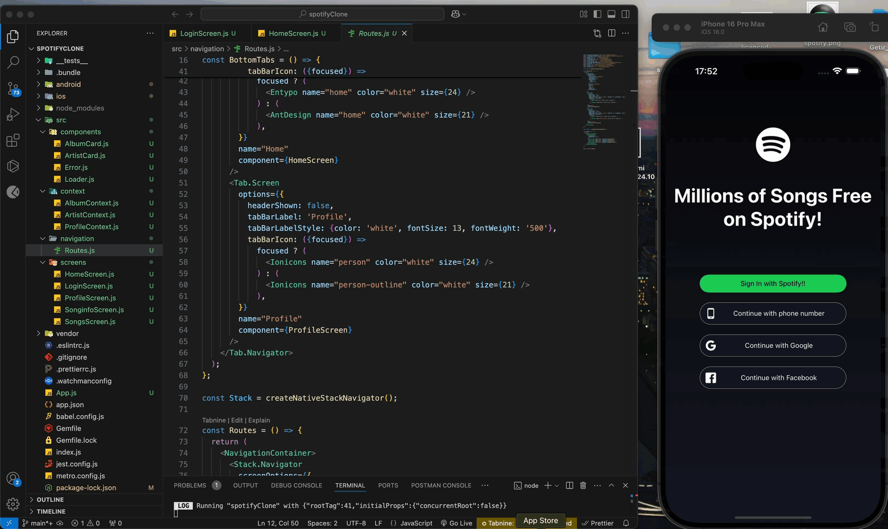

<h1> Spotify Clone 🎵🪩</h1>

<h3>* A Spotify-like music application developed using React Native. </h3>

<h3>* This project provides a modern, user-friendly experience enriched with elegant design elements and real-time music data integration through RapidAPI.</h3>

<h2>Features✨</h2>

<h2>🎤User Interface</h2>

<h3>* Minimalist and customizable design inspired by Spotify.</h3>

<h3>* react-native-linear-gradient for aesthetic gradient effects across different sections of the app.</h3>

<h3>* Minimalist and customizable design inspired by Spotify.</h3>

<h2>🎻Navigation and Transitions</h2>

<h3>* Smooth screen transitions with React Navigation.</h3>

<h3>* Tab-based navigation using @react-navigation/bottom-tabs.</h3>

<h3>* Dynamic screen structures via @react-navigation/native-stack.</h3>

<h2>🎧Music Playback Features</h2>

<h3>* Background playback support using react-native-track-player.</h3>

<h3>* Music control features (play, pause, skip forward/backward).</h3>

<h2>🎼Data Management and API Integration</h2>

<h3>* Real-time music data powered by RapidAPI.</h3>

<h3>* Efficient fetching and handling of music lists, track details, and other data using Axios</h3>

<h2>🎸Modular Components</h2>

<h3>* Flexible and stylish modals implemented with react-native-modal.</h3>

<h2>🪇Performance and Security</h2>

<h3>*Optimized data manipulation with Lodash</h3>

<h3> * Seamless cross-platform integration for iOS and Android.# spotify-clone-react-native</h3>

